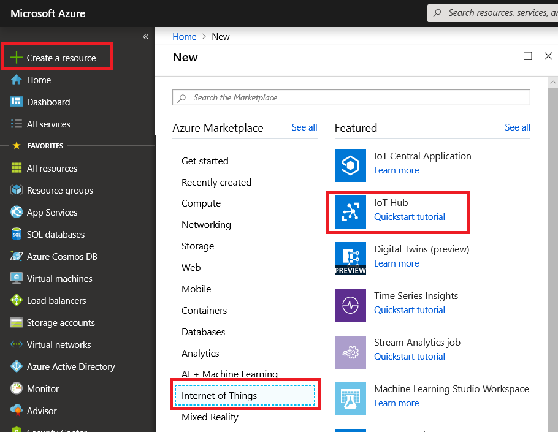
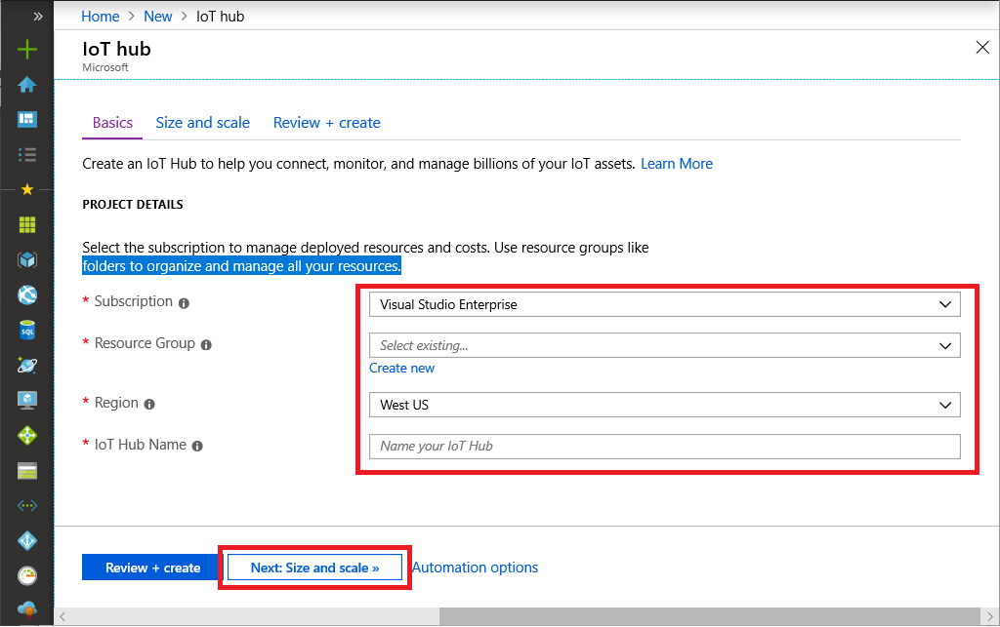
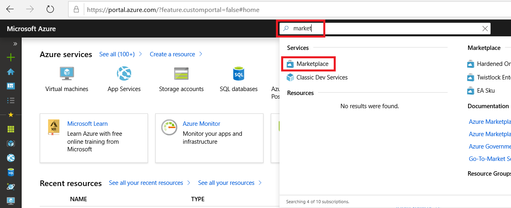
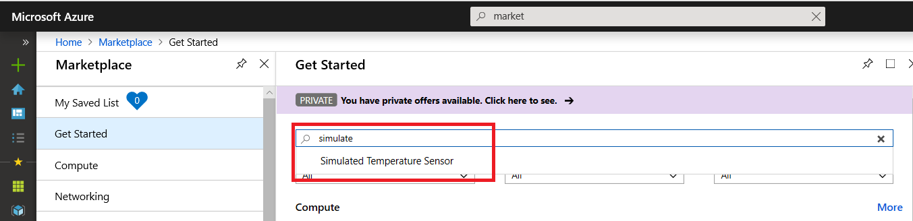

# Windows Server IoT 2019 + Azure IoT Edge (45 Min)

In many use cases, a Windows Server IoT 2019 can be used an IoT edge gateway that connects local devices and sensors to cloud services and apps. In this lab, we're going to walk you through how to turn a Windows Server IoT 2019 server into an IoT edge gateway. We will use virtual machines for this lab, however, the same steps described in this article can be applied to a Windows Server IoT 2019 on a physical machine.  

In this lab you learn how to:

1. Create an IoT Hub
1. Create an IoT Edge device in your IoT hub
1. Install and start the IoT Edge runtime on a Windows Server IoT 2019
1. Deploy a module to a Windows Server IoT 2019 from Marketplace

## Prerequisites

- Azure Subscription  
If you don't have an active Azure subscription, create a [free account](https://azure.microsoft.com/free) before you begin.
- Windows Server 2019, which can be a physical or virtual machine  

## Step 1 : Create an instance of IoT Hub

In this step, we will create an instance of Azure IoT Hub using [Azure Portal](https://portal.azure.com)

### Step 1.1 : Login to http://portal.azure.com

Open a browser and navigate to http://portal.azure.com, then follow sign in prompt to sign in to your Azure account

### Step 1.2 : Create an instance of Azure IoT Hub

Select **Create a resource** -> **Internet of Things** -> **IoT Hub** 



### Step 1.3 : Click **Add** to add a new IotHub instance  

Provide these information to create an instance of IoT Hub

|Data      |Description  |
|---------|---------|
|Subscription     |Subscription to use for the new IoT Hub         |
|Resource Group | Create a new Resource Group for this lab.   E.g. IoTBootCamp|
|Region     |Data center region nearest to you         |
|IoT Hub Name     |Provide a name that is globally unique.|

Confirm the uniqueness of IoT Hub name with green check mark.  Once all parameters are entered, Click **Next: Size and scale>>**



### Step 1.4 : Select Size and Scale

Select `F1: Free tier for Pricing and scale tier`


### Step 1.5 : Click **Review + create**, to create the IoTHub instance

## Step 2 : Register a new Azure IoT Edge device

In this step, we will create `Azure IoT Edge Device` for Windows Server IoT 2019 

### Step 2.1 : Open `IoT Edge` device view

Navigate to the IoTHub that was created, select **IoT Edge** -> **Add an Edge device**

### Step 2.2 : Provide a name for Windows Server IoT 2019

Click **Save** to create the device


### Step 2.3 : View all devices

All the edge-enabled devices that connect to your IoT hub are listed on the **IoT Edge** page.

## Step 3 : Retrieve the connection string

When you're ready to set up your physical device, you'll need a connection string which links your physical device with its identity in IoT hub.  
In this step, we will retrieve (Copy) the connection string for later use.

### Step 3.1 : Locate the Azure IoT Edge Device

From the **IoT Edge** page in the portal, click on the device ID from the list of Edge devices  

### Step 3.2 : Copy Connection String  

Copy the value of either **Connection string (primary key)** or **Connection string (secondary key)**. Save the connection string to a file for later part of the lab


## Step 4 : Connect to your Windows Server on a virtual machine

> [!IMPORTANT]  
> Instructors will provide Hostname and/or IP Address of Windows Server 2019 VM

### Step 4.1 : open a Remote Desktop Connection from your Windows 10 Dev machine

> [!TIP]  
> you can type RDP from Window's search, then select then Remote Desktop Connection app

### Step 4.2 : Type in the hostname or IP address of your server and click **connect**

### Step 4.3 : Login to your server

Winsdows Server 2019 VM Credential

```bash  
User Name : iotbootcamp  
Password  : bootcamp  
```

## Step 5 : Install IoT Edge Runtime on Windows

In this step, we will install Azure IoT Edge Runtime to your Windows Server IoT

### Step 5.1 : Open a Powershell window as an Administrator

### Step 5.2 : Deploy IoT Edge Runtime

The cmdlet checks whether your Windows machine is on a supported version, turns on the containers feature, and then downloads the moby runtime and the IoT Edge runtime.  

Run the **Deploy-IoTEdge** powershell cmdlet. 

```powershell
. {Invoke-WebRequest -useb aka.ms/iotedge-win} | Invoke-Expression; Deploy-IoTEdge
```

### Step 5.3 : Initialize IoT Edge Runtime  

The cmdlet initializes the finish the IoT Edge installation.  For IoT Edge Runtime to initialize, it needs `Connection String` from [Step 3.2 : Copy Connection String](#step-32--copy-connection-string)

```powershell
. {Invoke-WebRequest -useb aka.ms/iotedge-win} | Invoke-Expression; Initialize-IoTEdge
```

### Step 5.4 : Provide the device connection string

Provide the connection string from [Step 3.2 : Copy Connection String](#step-32--copy-connection-string)

Example :


### Step 5.5 : Verify Azure IoT Edge Runtime Status

Run the Get-Service command to confirm IoT Edge runtime is installed and running

```powershell
Get-Service iotedge
```


## Step 6 : Deploy Simulated Temperature Sensor from Marketplace to Windows Server

IoT Edge is used to connect devices and sensors to cloud. In this lab, we're going to use an existing simulator from Azure Marketplace. 

Azure Marketplace is an online applications and services marketplace where you can browse through a wide range of enterprise applications and solutions that are certified and optimized to run on Azure, including [IoT Edge modules](https://azuremarketplace.microsoft.com/marketplace/apps/category/internet-of-things?page=1&subcategories=iot-edge-modules).

### Step 6.1 : Open Azure IoT Edge Market Place 

From Azure portal, navigate to Marketplace or type Marketplace at the Search bar and select Marketplace



### Step 6.2 : Locate **Simulated Temperature Sensor**  

Within Marketplace, select **Get Started**, type in *simulated* at the search bar, then select **Simulated Temperature Sensor**



### Step 6.3 : Create Simulated Temperature Sensor module

Click **Create**


### Step 6.4 : Fill out the information on the Target Devices for IoT Edge Module

1. Choose your subscription and the IoT Hub to which the target device is attached.
1. Choose **Deploy to a device**.

1. Enter the name of the device or select **Find Device** to browse among the devices registered with your IoTHub and select the device you created earlier, which links to the Windows Server IoT 2019. 

1. Click **Create** to continue the standard process of configuring a deployment manifest, including adding other modules if desired. Details for the new module such as image URI, create options, and desired properties are predefined but can be changed. 

1. Take the default setting for the next few steps, and finally click **Submit** to deploy the temperature simulator to the Windows Server. 

## Step 5 : Confirm Temperature Simulator Module Deployment  

The module that you pushed creates sample data that you can use for testing. The simulated temperature sensor module generates environment data that you can use for testing later. The simulated sensor is monitoring both a machine and the environment around the machine. For example, this sensor might be in a server room, on a factory floor, or on a wind turbine. The message includes ambient temperature and humidity, machine temperature and pressure, and a timestamp. The IoT Edge tutorials use the data created by this module as test data for analytics.

Confirm that the module deployed from the cloud is running on your IoT Edge device.

```powershell
iotedge list
```

   

View the messages being sent from the temperature sensor module to the cloud.

```powershell
iotedge logs SimulatedTemperatureSensor -f
```

   

DONE!  