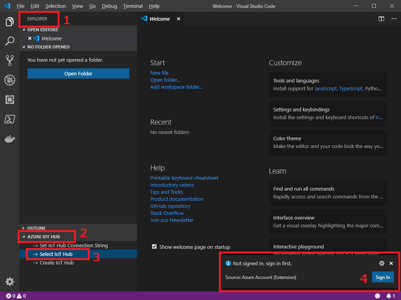

# Windows 10 IoT + Azure IoT Edge - Advance Lab (60 Min)

## Prerequisites

- An instance of IoT Hub from the previous HOL
- Dot Net Core 2.2
https://dotnet.microsoft.com/download/thank-you/dotnet-sdk-2.2.107-windows-x64-installer

## Key Components

## Step 1: Register a new Azure IoT Edge device

### Sign in to access your IoT hub

You can use the Azure IoT extensions for Visual Studio Code to perform operations with your IoT hub. For these operations to work, you need to sign in to your Azure account and select the IoT hub that you are working on.

1. In Visual Studio Code, open the **Explorer** view.

2. At the bottom of the Explorer, expand the **Azure IoT Hub Devices** section.

   

3. Click on the **...** in the **Azure IoT Hub Devices** section header. If you don't see the ellipsis, click on or hover over the header.

4. Choose **Select IoT Hub**.

5. If you are not signed in to your Azure account, follow the prompts and sign in to your Azure account.

6. Select your Azure subscription.

7. Select your IoT hub.

### Create a device

1. In the VS Code Explorer, expand the **Azure IoT Hub Devices** section.

2. Click on the **...** in the **Azure IoT Hub Devices** section header. If you don't see the ellipsis, click on or hover over the header.

3. Select **Create IoT Edge Device**.

4. In the text box that opens, give your device an ID.

In the output screen, you see the result of the command. The device info is printed, which includes the **deviceId** that you provided and the **connectionString** that you can use to connect your physical device to your IoT hub.

### View all devices

All the devices that connect to your IoT hub are listed in the **Azure IoT Hub Devices** section of the Visual Studio Code Explorer. IoT Edge devices are distinguishable from non-Edge devices with a different icon, and the fact that they can be expanded to show the modules deployed to each device.

   

### Retrieve the connection string

When you're ready to set up your device, you need the connection string that links your physical device with its identity in the IoT hub.

1. Right-click on the ID of your device in the **Azure IoT Hub Devices** section.

2. Select **Copy Device Connection String**.

   The connection string is copied to your clipboard.

You can also select **Get Device Info** from the right-click menu to see all the device info, including the connection string, in the output window.

## Step 2: Install IoT Edge on Windows Enterprise

### 1. Open a Powershell window as an Administrator

### 2. Run the **Deploy-IoTEdge** command,
 This command checks whether your Windows machine is on a supported version, turns on the containers feature, and then downloads the Moby runtime and the IoT Edge runtime. 

```powershell
. {Invoke-WebRequest -useb aka.ms/iotedge-win} | Invoke-Expression; Deploy-IoTEdge -ContainerOs Windows
```
Click Yes to the following pop-up questions. The machine will be restarted. After it's restarted, open a powershell window and run the command to finish the installation. 

### 3 Run the  Initialize-IoTEdge command to initialize the finish the IoT Edge installation

```powershell
. {Invoke-WebRequest -useb aka.ms/iotedge-win} | Invoke-Expression; Initialize-IoTEdge -ContainerOs Windows
```

### 4. Link to an IoT Edge device in IoTHub 

Provide the device connection string (saved from prior step). 


### 5. Run the Get-Service command to confirm IoT Edge runtime is installed and running

```powershell
Get-Service iotedge
```


To list all modules running in IoT Edge  

```powershell
iotedge list
```

## Step 3 : Download the IoT Edge sample from repo

[IoT Edge Samples](https://github.com/Azure/iotedge)

Example : Clone to C:\Repo

```powershell  
md c:\Repo
cd C:\Repo
git clone https://github.com/Azure/iotedge
```

## Step 4 : Build Sample

### 1. Check .Net installation

Make sure you have dotnet installed on your machine already. 

Run the following command to check

```powershell
dotnet --version
```

If not it's not installed, download and install dotnet 2.2 from: https://dotnet.microsoft.com/download/thank-you/dotnet-sdk-2.2.107-windows-x64-installer

### 2. Navigate to the SimulatedTemperatureSentor directory of the downloaded repo

```powershell
PS C:\repo\iotedge\edge-modules\SimulatedTemperatureSensor> dir

    Directory: C:\repo\iotedge\edge-modules\SimulatedTemperatureSensor

Mode                LastWriteTime         Length Name                                                                                                                           
----                -------------         ------ ----                                                                                                                           
d-----        5/20/2019   8:01 PM                config                                                                                                                         
d-----        5/20/2019   8:01 PM                docker                                                                                                                         
d-----        5/20/2019   8:01 PM                src                                                                                                                            
-a----        5/20/2019   8:01 PM           2958 SimulatedTemperatureSensor.csproj                                                                                              

```

### 3. Build Temperature Simulator:

```powershell
PS C:\repo\iotedge\edge-modules\SimulatedTemperatureSensor> dotnet publish -r win-x64
Microsoft (R) Build Engine version 16.0.450+ga8dc7f1d34 for .NET Core
Copyright (C) Microsoft Corporation. All rights reserved.

  Restore completed in 655.09 ms for C:\repo\iotedge\edge-util\src\Microsoft.Azure.Devices.Edge.Util\Microsoft.Azure.Devices.Edge.Util.csproj.
  Restore completed in 809.77 ms for C:\repo\iotedge\edge-modules\SimulatedTemperatureSensor\SimulatedTemperatureSensor.csproj.
  Restore completed in 817.74 ms for C:\repo\iotedge\edge-modules\ModuleLib\Microsoft.Azure.Devices.Edge.ModuleUtil.csproj.
  Microsoft.Azure.Devices.Edge.Util -> C:\repo\iotedge\edge-util\src\Microsoft.Azure.Devices.Edge.Util\bin\Debug\netstandard2.0\Microsoft.Azure.Devices.Edge.Util.dll
  Microsoft.Azure.Devices.Edge.ModuleUtil -> C:\repo\iotedge\edge-modules\ModuleLib\bin\Debug\netcoreapp2.1\Microsoft.Azure.Devices.Edge.ModuleUtil.dll
  SimulatedTemperatureSensor -> C:\repo\iotedge\edge-modules\SimulatedTemperatureSensor\bin\Debug\netcoreapp2.1\win-x64\SimulatedTemperatureSensor.dll
  SimulatedTemperatureSensor -> C:\repo\iotedge\edge-modules\SimulatedTemperatureSensor\bin\Debug\netcoreapp2.1\win-x64\publish\

PS C:\repo\iotedge\edge-modules\SimulatedTemperatureSensor> 

```

## Step 5 : Create Azure Container Registry

 A container repository is used to store container. In this lab, we're using the container registry to store the AI modules built from last steps. With the containers stored in Azure Container Registry, you can deploy the modules to the machines and devices where you want to run the moudule.

1. Select **Create a resource** > **Containers** > **Container Registry**  
  **Registry name** enter a registry name  
  **Resource group** select the resource group used from prior lab 
  use the default values for the other fields

1. Select **Create** to deploy.

    

1. When the **Deployment succeeded** message appears, select the container registry in the portal. 

1. Select **Access keys** and **Enable** Admin user 

1. Take note of the value of the **Login server**, and copy one of the passwords. You'll need these values in the following steps.

    
    
## Step 6: Containerize the Temperature Simulator app

In order for an app to be run as an edge module, the app needs to be containerize first. In the section we're going to walk through the steps to containerize an app. 

### 1. Set up Docker Environment 

Set the environment variables **WINDOW_WINMD**  and **DOCKER_HOST**

To get access to Windows.AI.MachineLearning and various other Windows classes an assembly reference needs to be added for Windows.winmd

The file path for the Windows.winmd file may be: 

```powershell
setx /m WINDOWS_WINMD "C:\Program Files (x86)\Windows Kits\10\UnionMetadata\[version]\Windows.winmd"

setx /m  DOCKER_HOST npipe:////./pipe/iotedge_moby_engine
```

### 2. Close Powershell and Open a new Powershell window for the environment variables to take effect

### 3. Create docker image for the Temperature Simulator app

```powershell 
PS C:\repo\iotedge\edge-modules\SimulatedTemperatureSensor> docker build .\bin\Debug\netcoreapp2.1\win-x64\publish -t tempsim -f .\docker\windows\amd64\Dockerfile
Sending build context to Docker daemon  77.43MB

Step 1/6 : ARG base_tag=2.1.10-nanoserver-1809
Step 2/6 : FROM mcr.microsoft.com/dotnet/core/runtime:${base_tag}
2.1.10-nanoserver-1809: Pulling from dotnet/core/runtime
9319e23c8670: Pulling fs layer
9932599cb91b: Pulling fs layer
4350fcc14134: Pulling fs layer
af993f0b5292: Pulling fs layer
29f6e54ef3cd: Pulling fs layer
  :
4350fcc14134: Pull complete
af993f0b5292: Pull complete
29f6e54ef3cd: Pull complete
2a38bc60ae92: Pull complete
Digest: sha256:5595baf37235ee2ac885cc2427cc9dcb6c60fe75870066a02552267772b5cbe9
Status: Downloaded newer image for mcr.microsoft.com/dotnet/core/runtime:2.1.10-nanoserver-1809
 ---> d6a221ed7eed
Step 3/6 : ARG EXE_DIR=.
 ---> Running in 9377693346a0
Removing intermediate container 9377693346a0
 ---> bd944d2fd66e
Step 4/6 : WORKDIR /app
 ---> Running in 48aa038a3592
Removing intermediate container 48aa038a3592
 ---> 9903409dc8ab
Step 5/6 : COPY $EXE_DIR/ ./
 ---> 82053db9eaa3
Step 6/6 : CMD ["dotnet", "SimulatedTemperatureSensor.dll"]
 ---> Running in 94918456057a
Removing intermediate container 94918456057a
 ---> 4aad993849a8
Successfully built 4aad993849a8
Successfully tagged tempsim:latest
```

## Step 7: Push the Docker container to Azure Container Registry

### 1. Login to your Azure Container Registry

```ps
PS C:\repo\Samples\EdgeModules\Temperature SimulatorObjectDetection\cs> docker login {ACR_NAME}.azurecr.io
Username: {ACR_NAME}
Password:
Login Succeeded
```

### 2. Push the Docker image to AZure Container Registry

```powershell

PS C:\IOT-AI-Sample\iotedge\edge-modules\SimulatedTemperatureSensor> docker tag tempsim {ACR_NAME}.azurecr.io/tempsim 

PS C:\repo\iotedge\edge-modules\SimulatedTemperatureSensor> docker push {ACR_NAME}.azurecr.io/tempsim
The push refers to repository [{ACR_NAME}.azurecr.io/tempsim]
df1fb756da5d: Preparing
b73311fbd316: Preparing
a406b6d40c15: Preparing
96853e0dc821: Preparing
   :
146252efae6c: Pushed
6eaf1cf63dfc: Pushed
273db4b66a2d: Skipped foreign layer
761ff3ef5aab: Pushed
a2bb3d322957: Pushed
b73311fbd316: Pushed
5c3e3ab9e119: Pushed
latest: digest: sha256:d323fe3ae869d39802ba1c3c0f76f7ed0e40d1d7f7b2041a12e5faf5391bbcf0 size: 2507

```

## Step 8: Deploy module to IoT Edge 

You are now ready to deploy the Simulated Temperature module on your device. 

In this section, you use the **Set Modules** wizard in the Azure portal to create a *deployment manifest*. A deployment manifest is a JSON file that describes all the modules that will be deployed to a device, the container registries that store the module images, how the modules should be managed, and how the modules can communicate with each other. Your IoT Edge device retrieves its deployment manifest from IoT Hub, then uses the information in it to deploy and configure all of its assigned modules. 

### 1. In the Azure portal, in your IoT hub, go to **IoT Edge**, and then open the details page for your IoT Edge device.

### 2. Select **Set modules**

For the Container Registry Settings:  
- Name: ACR_NAME
- Address: {ACR_NAME}.azurecr.io
- Username: RLACR
- Password: {Your ACR Password} 

> [!NOTE]  
> ACR Credential can be obtained from your the Azure Container Registry created earlier under Access Keys  

- Click **Add** and select **IoT Edge Module**
- Type a name for your module, type **tempsim**
- For the image URI, enter **{ACR_NAME}.azurecr.io/tempsim** 
- Leave the other settings unchanged and select **Save**

## Step 9: Confirm the Temperature Simulator module has been deployed

To the view logs of the Temperature Simulator module

```powershell
PS C:\repo\iotedge\edge-modules\SimulatedTemperatureSensor> iotedge list 
NAME             STATUS           DESCRIPTION      CONFIG
tempsim          running          Up 4 seconds     {ACR_NAME}.azurecr.io/tempsim:latest
edgeHub          running          Up 7 seconds     mcr.microsoft.com/azureiotedge-hub:1.0
edgeAgent        running          Up 30 seconds    mcr.microsoft.com/azureiotedge-agent:1.0

PS C:\repo\iotedge\edge-modules\SimulatedTemperatureSensor> docker ps 
CONTAINER ID        IMAGE                                      COMMAND                  CREATED             STATUS              PORTS                                            
                      NAMES
073ff6d9054c        {ACR_NAME}.azurecr.io/tempsim:latest            "dotnet SimulatedTem…"   24 seconds ago      Up 21 seconds                                                      
                        tempsim
6f6c95187c0d        mcr.microsoft.com/azureiotedge-hub:1.0     "dotnet Microsoft.Az…"   27 seconds ago      Up 25 seconds       0.0.0.0:443->443/tcp, 0.0.0.0:5671->5671/tcp, 0
.0.0.0:8883->8883/tcp   edgeHub
b411b4fd6545        mcr.microsoft.com/azureiotedge-agent:1.0   "dotnet Microsoft.Az…"   49 seconds ago      Up 47 seconds                                                      
                        edgeAgent

PS C:\repo\iotedge\edge-modules\SimulatedTemperatureSensor> docker logs -f tempsim  

SimulatedTemperatureSensor Main() started.
Initializing simulated temperature sensor to send 500 messages, at an interval of 5 seconds.  
    :  
    :
	5/20/2019 11:30:21 PM> Sending message: 1, Body: [{"machine":{"temperature":21.274294573824989,"pressure":1.0312487489167708},"ambient":{"temperature":21.378854756652775,"humid
ity":24},"timeCreated":"2019-05-21T03:30:21.1985626Z"}]
	5/20/2019 11:30:26 PM> Sending message: 2, Body: [{"machine":{"temperature":22.294024133726033,"pressure":1.1474204709308138},"ambient":{"temperature":21.308749485671868,"humid
ity":24},"timeCreated":"2019-05-21T03:30:26.5174959Z"}]
    :  
    :  
	5/20/2019 11:31:37 PM> Sending message: 16, Body: [{"machine":{"temperature":31.028983515933614,"pressure":2.1425424258658547},"ambient":{"temperature":20.988973313704587,"humi
dity":26},"timeCreated":"2019-05-21T03:31:37.0984276Z"}]

PS C:\repo\iotedge\edge-modules\SimulatedTemperatureSensor> 
```

### Step 10: Stop IOT Edge 

To  stop IoT Edge, you can run the command below: 

```powershell
Stop-Service iotedge
```