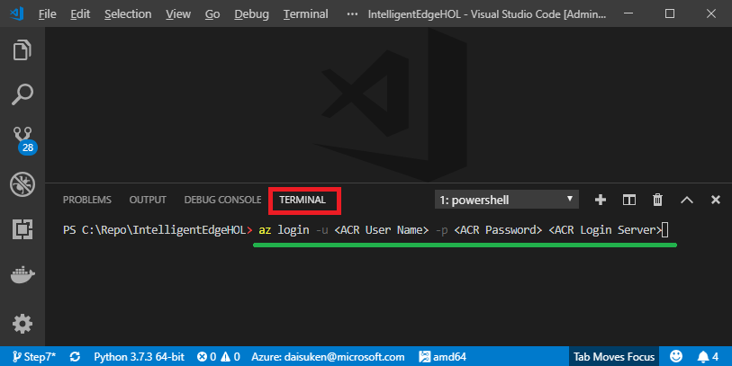

# Building Intelligent Edge Device

In this Hands on Lab, we will create following scenarios

- Setup Azure IoT Edge Runtime Environment
- Clone, edit, and compile Azure IoT Edge Module
- Deploy the Azure IoT Edge Module
- Control the Azure IoT Ede Module from Cloud

## Prerequisites

In order to complete this lab, this instruction assumes you are familiar with :

- Basics of Azure IoT Hub
- Operating and navigate [Azure Portal](http://portal.azure.com)
- Operating and navigating **Windows 10 UI**
- Operating and navigating **Visual Studio Code UI**
- Operating and navigating **Ubuntu 18.04 UI**, Terminal (bash or any console shell), and text editor such as gedit, vi, or nano editor

## Overview of this hands on lab (HOL)

This HOL consists of 9 major steps.  

- [Step 1:](#step-1--azure-iot-hub) Setup the Azure IoT Hub
- [Step 2:](#step-2--azure-iot-edge-device) Setup the Azure IoT Edge device in the IoT Hub
- [Step 3:](#step-3--azure-iot-edge-runtime-environment) Connect to the target device (Ubuntu 18.04) Virtual Machine
- [Step 4:](#step-4--clone-source-code) Clone Sample Source code from Azure Devops
- [Step 5:](#step-5--azure-container-registry) Setup the Azure Container Registry 
- [Step 6:](#step-6--modify-sample-code) Modify Sample Source Code
- [Step 7:](#step-7--build-and-push-container-image) Build and Push IoT Edge module without AI
- [Step 8:](#step-8--deploy-module) Deploy the container
- [Step 9:](#step-9--add-ai-inference-code) Add AI inference to your module
- Step 10: Deploy new module

## Development Environment (DevEnv)

***< Work in Progress>***

In this lab, laptops / Surface Pro are pre-configured with following software/tools

- A PC to install and run Windows 10
- Windows 10 IoT  
- Visual Studio Code (VSCode)
- VSCode Extensions
  - IoT Edge Extension
- Git tools  
  Git command line tool as well as Github Desktop are pre-installed in DevEnv
- Docker for Desktop
- VNC Client
- Putty

## Target Device

***< Work in Progress>***

Hyper-V Virtual Machines are pre-configured with following settings/software/tools

- A Server Machine running Ubuntu VM  
  For this lab, VMs are running with following resources
  - 3 Virtual Processors
  - 8GB RAM
  - 20GB Virtual Hard Drive
- Ubuntu 18.04
- SSH Server
- VNC Server

### Ubuntu VM Credential

```bash  
User Name    : iotbootcamp  
Password     : bootcamp  
VNC Password : bootcamp
```

## Sample Code / Module

### Module Functionality

***< Work in Progress>***

The sample code provides three major functionalities.  

- Video Stream  
  The modules will read video stream from one of following sources  
  - YouTube Video  
  - RTSP IP Camera  
  - Webcam  
      Not applicable for this Hands on Lab

- AI Inference  
  The module can run Computer Vision AI Inference.  
  This module uses Yolo (You Only Look Once) v3 pre-trained model.

- Web Server  
  The module runs a small web server functionality so you can see the video stream

### Controlling/Managing the Module  

***< Work in Progress> Add Module Twin Sample***

There are two ways you can manage/controlling the module  

- Deployment Manifest  
  You can control the start up time setting(s) of the module via `createOption` parameter in the Deployment Manifest.

- Device Twin  
  You can change settings through Module Twin after the container started running.  
  - VideoSource  
    Source of video stream/capture source

  - ConfidenceLevel  
    Confidence Level threshold.  The module ignores any inference results below this threshold.

  - Verbose  
    Logging verbosity.  For debugging

  > [!TIP]  
  > You can also pre-configure Module Twin `desired` setting in the Deployment Manifest

## Step 1 : Azure IoT Hub  

Using the **Windows 10 DevEnv**, create an IoT Hub if you do not have one.  

> [!TIP]  
> Pick your favorite tool to create a new IoT Hub


|Tool     |Link     |
|---------|---------|
|Portal   |[Create an IoT hub using the Azure portal](articles/iot-hub/iot-hub-create-through-portal.md)           |
|AZ CLI   |[Create an IoT hub using the Azure CLI](articles/iot-hub/iot-hub-create-using-cli.md)         |
|VSCode   |[Create an IoT hub using the Azure IoT Tools for Visual Studio Code](articles/iot-hub/iot-hub-create-use-iot-toolkit.md)         |

## Step 2 : Azure IoT Edge Device

Using the **Windows 10 DevEnv**, create an IoT Edge Device in the IoT Hub from [Step 1](#step-1--prepare-azure-iot-hub).  

> [!TIP]  
> Pick your favorite tool to create a new Azure IoT Edge device.

|Tool     |Link     |
|---------|---------|
|Portal   |[Register a new Azure IoT Edge device from the Azure portal](articles/iot-edge/how-to-register-device-portal.md)         |
|AZ CLI   |[Register a new Azure IoT Edge device with Azure CLI](articles/iot-edge/how-to-register-device-cli.md)         |
|VSCode   |[Register a new Azure IoT Edge device from Visual Studio Code](articles/iot-edge/how-to-register-device-vscode.md)         |

Please verify you can see the Azure IoT Edge Device in VSCode `Azure IoT Hub Devices` pane in the left bottom corner of VSCode UI.


## Step 3 : Azure IoT Edge Runtime Environment

Installing the Azure IoT Edge Runtime to the Hyper-V VM is x steps.

1. Connect to Ubuntu console via SSH or VNC (Linux version of Remote Desktop)  
2. Download and install libraries and the Azure IoT Edge runtime modules  
3. Configure the Azure IoT Edge runtime to authenticate and connect to the IoT Hub from [Step 1](#step-1--prepare-azure-iot-hub)  

### Step 3.1 : Connect to Ubuntu VM  

In order to install the Azure IoT Edge runtime you need a console access.  
The target Ubuntu installation is pre-configured to accept 2 options:

- Connect with SSH
- Connect with VNC Viewer

> [!TIP]  
> Feel Free to install your favorite SSH client and/or VNC Client software to the DevEnv. 

> [!NOTE]  
> Instructors will provide you Host Name and/or IP Address of VMs for your use

#### Option 1 : SSH

1. Start Putty on **Windows 10 DevEnv**
1. Enter VM Host Name or IP Address

    

1. Dismiss Security Warning Pop-up by clicking `Yes`  

    

1. Login using following credential  

    ```bash
    **login as** : `iotbootcamp`  
    **password** : `bootcamp`  
    ```

    

#### Option 2 : VNC

1. Start VNC Client on **Windows 10 DevEnv**  
  

1. Enter VM Host Name or IP Address  
  

1. Dismiss Security Warning Pop-up  
  You may want to select `Don't warn me about this again on this computer.` checkbox.  
  With this setting you do not have to see this warning again.  
   

1. Enter Password `bootcamp` 
  You may want to select `Remember password` checkbox so you do not need to enter password again  
  

1. You should see lock screen  
  Hit `enter` or click with mouse to display login window  
  

1. Enter Password `bootcamp`  
  

1. You should see Ubuntu Desktop  
  

1. Hit `ctrl + alt + t` to open **Terminal**  
  

> [!TIP]  
> Once you are connected, VNC Viewer remembers connections.  You can simply double click to connect again.  
> 

### Step 3.2 : Install the Azure IoT Edge runtime

Please follow the steps describe in [Install the Azure IoT Edge runtime on Linux (x64)](articles/iot-edge/how-to-install-iot-edge-linux.md)

### Step 3.3 : Verify connection

Upon successful configuration and connection, the Azure IoT Edge runtime components `$edgeAgent` and `$edgeHub` should show **Connected** status (Green Icons) in VSCode.


## Step 4 : Clone Source Code

Clone the source code for the sample module from Azure Devops repo.  
You may use `git` command line or `Git Desktop`.

> [!NOTE]  
> In this instruction, we will use `C:\Repo` folder.

### Step 4.1 : Clone with Git command line

1. On the **Windows 10 DevEnv laptop**, open `Command console` (or CMD) or `Powershell` console.
1. Create a folder `C:\Repo`
1. Navigate to `C:\Repo`
1. Run `git clone` command

```bash
md C:\Repo
cd C:\Repo
git clone https://cdsiotbootcamp.visualstudio.com/bootcamp2019/_git/IntelligentEdgeHOL 
```

### Step 4.2 : Clone Source Code

***< Work in Progress> Add screen shots***

Git Desktop provides GUI environment, which may be more convenient.

> [!WARNING]  
> Github Desktop requires you to login to Github with your Github account.  
> If you do not have Github account, please use git command line described in the [previous step](#step-41--clone-with-git-command-line)

1. Start Github Desktop on **Windows 10 DevEnv laptop**
1. Sign in to Github using your Github account
1. Clone the sample source code from `https://cdsiotbootcamp@dev.azure.com/cdsiotbootcamp/bootcamp2019/_git/IntelligentEdgeHOL`

## Step 5 : Azure Container Registry

On the **Windows 10 DevEnv laptop**, create an instance of Azure Container Registry (ACR).  
ACR is used to :

- The DevEnv uploads (a.k.a. **Push**) container images  
- The Azure IoT Edge runtime downloads (a.k.a. **Pull**) the Azure IoT Edge module(s) during module deployment

> [!TIP]  
> Pick your favorite tool to create a new ACR.

> [!TIP]  
> Make sure to enable Admin Access.  
> Copy following information to access from the DevEnv

|Tool     |Link     |
|---------|---------|
|Portal   |[Create a private container registry using the Azure portal](articles/container-registry/container-registry-get-started-portal.md)         |
|AZ CLI   |[Quickstart: Create a private container registry using the Azure CLI](articles/container-registry/container-registry-get-started-azure-cli.md)       |
|VSCode   | [Create a private container registry using Azure PowerShell](articles/container-registry/container-registry-get-started-powershell.md)        |

## Step 6 : Sample Code

We will configure the sample code with some settings.  

- Open Sample Code Project
- ACR connection credential
- ACR Login
- Azure Login

### Step 6.1 : Open Sample Project

1. Start VSCode On the **Windows 10 DevEnv laptop**, if you have not started yet  

1. From `File` -> `Open Folder`  

1. Select `IntelligentEdgeHOL` folder you cloned the sample code in the [previous step](#step-4--clone-source-code)  
    Example :  `C:\Repo\IntelligentEdgeHOL`

    

### Step 6.1 : Login to Azure

This step is required so your can access IoT Hub and the Azure IoT Edge Devices in VSCode extension.

1. Open `Command Palette` in VSCode  
  `ctrl + shift + p` or `[View] menu -> command palette`
1. Type `sign` in command palette.  You should see `Azure : Sign in`  
  Select `Azure : Sign in`  
  
  

1. Complete the sign in process using browser
  Browser should automatically open with Sign in page  

  

### Step 6.2 : Login to ACR

This step is required to push the containers to ACR

1. Open `Terminal` in VSCode  
  `ctrl + `` or `[View] menu -> Terminal`

  

### Step 6.3 : Edit `.env` file

This step is required for the module deployment.  The deployment manifest contains ACR credential so that the Azure IoT Edge runtime can access ACR to pull container(s)
Update `.env` file for ACR Login credential

1. Select `.env` file from Explorer pane
1. Update ACR Login Server, User Name, and Password

  

Example :

```bash
CONTAINER_REGISTRY_URL=bootcampfy19acr.azurecr.io
CONTAINER_REGISTRY_USERNAME=bootcampfy19acr
CONTAINER_REGISTRY_PASSWORD=abcdefg1234567890
```

> [!TIP]  
> You can get ACR login credential in Azure Portal  
> 

### Step 6.4 : Specify Video Source

1. Open Web Browser and navigate to http://www.youtube.com
1. Select any video
1. `Right Click` on the video window, and select `Copy video URL`
  

> [!TIP]  
> Choose video that contains objects Yolo pre-trained model can recognize.  
> Please see [the list](#yolo-pre-trained-model) of objects Yolo re-trained model can recognize.

Example :

```bash
CONTAINER_VIDEO_SOURCE=https://www.youtube.com/watch?v=abcdEFGH
```

## Step 7 : Build and Push Container Image

The first step is to build and push container

1. Select and right click on `deployment.template.json` from the Explorer pane

1. Click `Build and Push IoT Edge Solution`

    

1. Wait until build and push completes
  You can see the progress in the `terminal window`

1. Verify `deployment.amd64.json` is generated in `config` folder

    

## Step 8 : Deploy Module

This modules only reads video stream and display in the web UI.

### Step 8.1 : Deploy `YoloModule`

1. Select and right click `deployment.amd64.json`

1. Select `Create Deployment for Single Device`

    

1. `Command Palett` will appear on the top of VSCode window

1. Select the Azure IoT Edge device from the list

    

1. Check the progress by monitoring `edgeAgent` log


    > [!TIP]For exam!  
    > `sudo docker logs -f edgeAgent`  
    > `sudo iotedge logs edgeAgent`

    Example output

    ```bash
    2019-05-15 01:34:09.314 +00:00 [INF] - Executing command: "Command Group: (
      [Create module YoloModule]
      [Start module YoloModule]
    )"
    2019-05-15 01:34:09.314 +00:00 [INF] - Executing command: "Create module YoloModule"
    2019-05-15 01:34:09.886 +00:00 [INF] - Executing command: "Start module YoloModule"
    2019-05-15 01:34:10.356 +00:00 [INF] - Plan execution ended for deployment 10
    2019-05-15 01:34:10.506 +00:00 [INF] - Updated reported properties
    2019-05-15 01:34:15.666 +00:00 [INF] - Updated reported properties
    ```

1. Verify `YoloModule` is deployed and running

    > [!TIP]
    > For exam!  
    > `sudo iotedge list`  
    > `sudo docker ps`  

    ```bash
    iotbootcamp@Ubuntu201:~$ sudo iotedge list
    NAME             STATUS           DESCRIPTION      CONFIG
    edgeAgent        running          Up 11 hours      mcr.microsoft.com/azureiotedge-agent:1.0
    edgeHub          running          Up 11 hours      mcr.microsoft.com/azureiotedge-hub:1.0
    YoloModule       running          Up 36 seconds    bootcampfy19acr.azurecr.io/yolomodule:step7-8-amd64
    
    iotbootcamp@Ubuntu201:~$ sudo docker ps
    CONTAINER ID        IMAGE                                                 COMMAND                   CREATED             STATUS              PORTS                                                                  NAMES
    2357e72e612b        bootcampfy19acr.azurecr.io/yolomodule:step7-8-amd64   "python -u ./main.py"     3 minutes ago       Up 3 minutes        0.0.0.0:80->80/tcp                                                     YoloModule
    ecde10a04f2b        mcr.microsoft.com/azureiotedge-hub:1.0                "/bin/sh -c 'echo \"$…"   12 hours ago        Up 12 hours         0.0.0.0:443->443/tcp, 0.0.0.0:5671->5671/tcp, 0.0.0.0:8883->8883/tcp   edgeHub
    46771922a8b9        mcr.microsoft.com/azureiotedge-agent:1.0              "/bin/sh -c 'echo \"$…"   12 hours ago        Up 12 hours                                                                                edgeAgent
    ```

### Step 8.2 : Verifty Module is functioning

You can confirm the module is working as expected by accessing the web server.

1. Open the Web Server with IP Address or Ubuntu VM Host Name  
  e.g. http://ubuntu201 or http://192.168.0.120

2. You should be able to see video stream

    

3. Check logging from `YoloModule`

    > [!TIP]
    > For exam!  
    > `sudo iotedge logs <Module Name>`  
    > `sudo docker logs <Moudle Name>`  
    >
    > `-f` : option is to *follow* logging  
    > `--tail <number>` : show last N lines  
    >  
    > `sudo docker logs -f YoloModule --tail 100 

```bash
iotbootcamp@Ubuntu201:~$ sudo docker logs -f YoloModule --tail 50
[youtube] unPK61Hz3Rw: Downloading webpage
[youtube] unPK61Hz3Rw: Downloading video info webpage
[download] Destination: /app/video.mp4
[download] 100% of 43.10MiB in 00:0093MiB/s ETA 00:00known ETA
Download Complete
===============================================================
videoCapture::__Run__()
   - Stream          : False
   - useMovieFile    : True
Camera frame size    : 1280x720
       frame size    : 1280x720
Frame rate (FPS)     : 29

device_twin_callback()
   - status  : COMPLETE
   - payload :
{
    "$version": 4,
    "Inference": 1,
    "VerboseMode": 0,
    "ConfidenceLevel": "0.3",
    "VideoSource": "https://www.youtube.com/watch?v=tYcvF8o5GXE"
}
   - ConfidenceLevel : 0.3
   - Verbose         : 0
   - Inference       : 1
   - VideoSource     : https://www.youtube.com/watch?v=tYcvF8o5GXE

===> YouTube Video Source
Start downloading video
WARNING: Assuming --restrict-filenames since file system encoding cannot encode all characters. Set the LC_ALL environment variable to fix this.
[youtube] tYcvF8o5GXE: Downloading webpage
[youtube] tYcvF8o5GXE: Downloading video info webpage
[download] Destination: /app/video.mp4
[download] 100% of 48.16MiB in 00:0080MiB/s ETA 00:00known ETA
Download Complete
```

### Step 8.3 : Change Video Source

Let's change Youtube video through Module Twin.  

1. In VSCode, `Azure IoT Hub Devices` window, expand the Azure IoT Edge Device until you see `YoloModul`

1. Select and right click on `YoloModule`
1. Select `Edit Module Twin`

    


1. In the editor window `azure-iot-module-twin.json` should open

    > [!TIP]
    > For exam!  
    > You can show/hide side bar to get bigger editor window  
    > `ctrl + B` or click button on the top left  
    >   

1. Edit `desired` -> `VideoSource` to set a new different YouTube (c) video

    

1. Right click on anywhere Editor widow, then select `Update Module Twin`

    

1. Depending on the size of video, it may take some time but new video should start playing in your browser

## Step 9 : Add AI Inference Code


```json

```


```
sudo apt-get install -y openssh-server
sudo apt-get install -y curl git
curl https://packages.microsoft.com/config/ubuntu/18.04/prod.list > ./microsoft-prod.list
sudo cp ./microsoft-prod.list /etc/apt/sources.list.d/
curl https://packages.microsoft.com/keys/microsoft.asc | gpg --dearmor > microsoft.gpg
sudo cp ./microsoft.gpg /etc/apt/trusted.gpg.d/

sudo apt-get update
sudo apt-get install moby-engine
sudo apt-get install moby-cli

https://www.youtube.com/watch?v=H2oonkOZkzY


## Yolo Pre-trained Model

Yolo pretrained model recognizes following objects.

```bash
person
bicycle
car
motorbike
aeroplane
bus
train
truck
boat
traffic light
fire hydrant
stop sign
parking meter
bench
bird
cat
dog
horse
sheep
cow
elephant
bear
zebra
giraffe
backpack
umbrella
handbag
tie
suitcase
frisbee
skis
snowboard
sports ball
kite
baseball bat
baseball glove
skateboard
surfboard
tennis racket
bottle
wine glass
cup
fork
knife
spoon
bowl
banana
apple
sandwich
orange
broccoli
carrot
hot dog
pizza
donut
cake
chair
sofa
pottedplant
bed
diningtable
toilet
tvmonitor
laptop
mouse
remote
keyboard
cell phone
microwave
oven
toaster
sink
refrigerator
book
clock
vase
scissors
teddy bear
hair drier
toothbrush
```